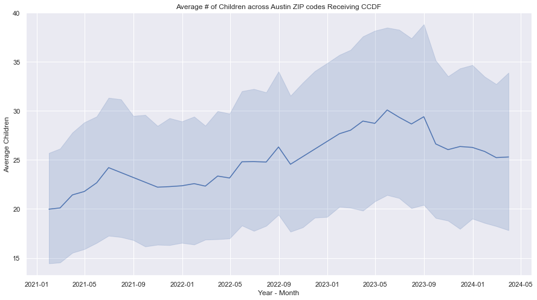
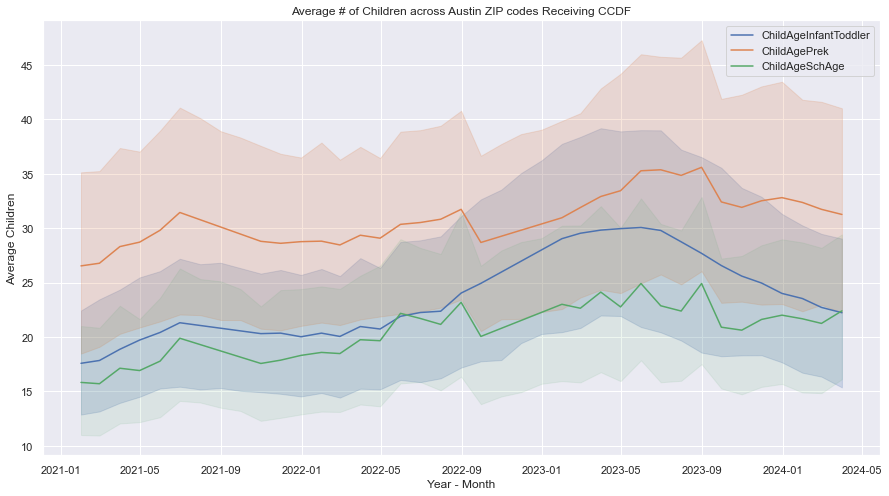
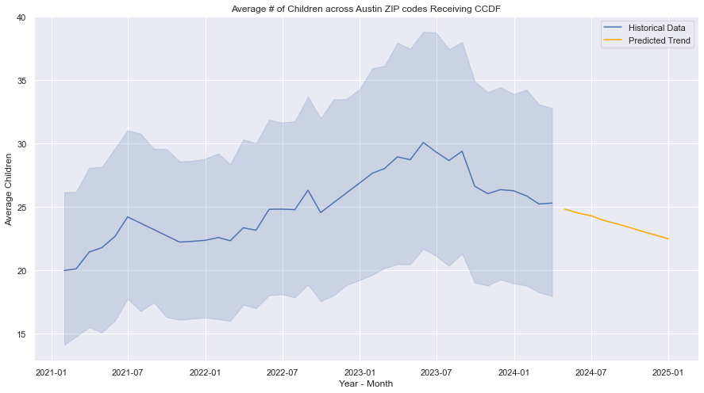
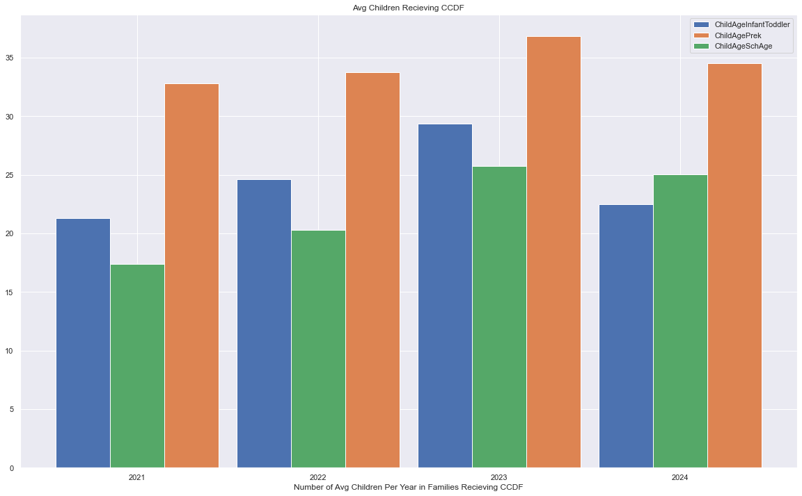
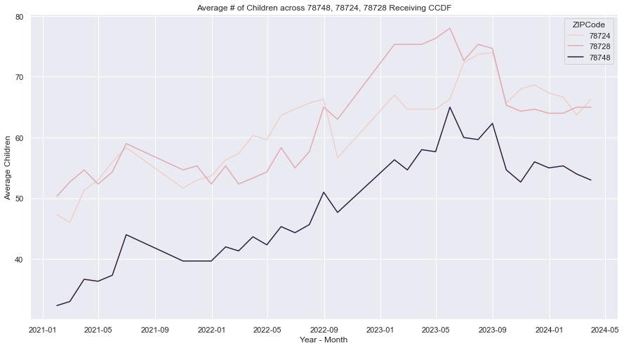

# Child-Care Needs According to CCDF Assistance

Child-care is a key factor in the multi-pronged implementation of poverty reduction (https://www.povertycenter.columbia.edu/child-care-and-paid-family-leave) within the United States.

To understand the child-care needs of the Greater Austin area, I report the findings of my exploratory analysis through the publically available demographic data of children receiving Child Care and Development Fund (CCDF) assistance. 

My findings include the following notable patterns:

* Overall, the number of children receiving CCDF assistance is **trending upwards** from Q1 2021 to Q1 2024.
    * The demographics experiencing the largest increases (across the categories of ethnicity, gender, and age) are `ChildEthnicityHispLatino`, `ChildFemale`, and `ChildAgeSchAge`.

* However, a notable decrease occurred from Q3 2023 to Q1 2024.
    * The demographics experiencing the largest decreases (across the categories of ethnicity, gender, and age) are `ChildRaceBlackAfriAmer`, `ChildMale`, and `ChildInfantToddler`.

* Initial time series models signal a **decrease** in children receiving assistance in 2024.

* Across all recorded years, pre-kindergarten-aged children account for the majority of children in families receiving assistance.

* The majority of ZIP codes in Austin have experienced an **increase** in children receiving assistance, with 78748, 78724, and 78728 experiencing the largest of differences.

## Methodology

1. Collected open source data from https://data.texas.gov/ (Monthly Child Care Services Data Report - Children Served by ZIP Code Q1 2021 to Q1 2024)
2. Filtered data town to Greater Austin Area (by ZIP Code)
3. Checked for data quality (missing values according to time, ZIP code, and column, as well as general outliers)
4. Performed exploratory analysis 

## Data Quality Findings

1. 2021 Q3 & 2022 Q4 are duplicates of 2021 Q2 & 2022 Q2 respectively (i.e. these quarters are missing).
2. To protect privacy, `*` symbol is placed to left-censor data where ZIP codes contain < 5 children.
3. ZIP codes have not all been consistently recorded throughout all years (only 33 out of 60 ZIP codes have been recorded each year)
4. Demographic columns (`ChildRaceAsian`, `ChildDisability`, `ChildRaceAmIndAlaNat`) contain >80% censored data.

## Risks

1. Duplicate data inflates values for Q3 2021 & Q4 2022. 
2. Each month entails at least 50% censored data, 
3. Inconsistent data recording introduces invalid findings (one year might have more numbers simply due to expanded data collection).
4. Low sample size of current data is insufficient to generalize findings.

## Solutions

1. Removed duplicated data, reached out to the dataset owner on this concern, and linearly imputed missing data using present values.
2. Replaced censored data with a constant of `2.5`. 
3. Removed all but 33 consistent ZIP codes from data.
4. Remove demographic columns (`ChildRaceAsian`, `ChildDisability`, `ChildRaceAmIndAlaNat`) containing > 80% imputed data.

## Exploratory Hypotheses

As overlap exists amongst demographics (multiple demographic labels can apply to the same child), I strictly use the age demographics (`ChildInfantToddler`, `ChildAgePrek`, `ChildAgeSchAge`) when calculating averages.

### Positive Overall Trend 

  

The number of children receiving CCDF assistance is trending upwards, with the beginning of Q1 2021 showing an average of 19.97 children per ZIP code and the end of Q1 2024 concluding with an average of 25.29 children per ZIP code (26.62% change).

### Apparent Decrease from Q3 2023 to Q1 2024

  

There has also been a notable decline in children receiving CCDF assistance from August 2023 to March 2024 which does not follow seasonal trend. In August 2023 an average of 29.39 children per ZIP code were receiving assistance, which decreased to 25.29 by March 2024 (-13.95%).

Limiting our scope to the age demographic, `ChildInfantToddler` experienced the most notable decrease in the age category. In August 2023, there was an average of 27.6 children in the `ChildInfantToddler` category. By March 2024, this number decreased to 22.2 (-19.7%). A demographic shift could possibly explain this drop in values during this time period, but then an increase in the `ChildAgePreK` column should be expected as well. However, this is not the case, as both the `ChildAgePreK` and `ChildAgeSchAge` demographic decreased by 12.17% and 10.09% respectively. 

### Modeling Future Outcomes

  

To model future values in this dataset, I choose an ARIMA model to account for non-stationarity in the dataset. Using this model we can observe that the trend for average children is predicted to decrease to an average of 22.47 by December 2024. 

### Pre-Kindergarten Aged Children Account for Largest Share of Age Demographics

  

Year over year, the average number of children across all ZIP codes in the `ChildAgePreK` demographic is larger the other 2 age demographics (`ChildInfantToddler`, `ChildAgeSchAge`)

### Notable ZIP Codes with Positive Trend

  

When only considering the quantity of children across age demographics, 72% of Austin ZIP codes have experienced an increase in children recieving CCDF assistance from January 2021 to March 2024, 16% of ZIP codes have experienced no change, and finally, 12% of ZIP codes have experienced a decrease. The most notable changes in ZIP codes include:

* 78748 (Manchaca): 32.33 in 2021 to 53 in 2024  
* 78724 (Daffin): 47.33 in 2021 to 66.33 in 2024  
* 78728 (Wells Branch): 50.33 in 2021 to 65 in 2024  

## Prescriptions 

* Enhance Spanish language assistance within child-care centers, in support for families with children in the increasing `ChildEthnicityHispanicLatino` demographic.
* Target outreach to families with children that are within the `ChildRaceBlackAfriAmer` and `ChildInfantToddler` demographics to identify cause in decrease.
*  Anticipate consistent need from 2023 into 2024 for child-care for children in the `ChildAgeSchAge` category, with a potential reduced need for `ChildInfantToddler`category.
* Enhance Pre-K child-care programs for 2024, as children in the `ChildAgePreK` demographic consistently make up the largest share of those recieving assistance according to age. 
* Investigate and tailor outreach for child-care needs in key ZIP codes of 78748, 78724, and 78728. Analyze which demographic shifts account for largest changes in these ZIP codes.

## Next Steps

* Investigate underlying causes of decrease of children receiving CCDF from 2023 to 2024, through statistical methods as well as policy, economic, and demographic research.
* Receive data from missing quarters.
* Investigate demographic distributions to better model censored data.
* Investigate individual ZIP Code demographics to better understand trend and target outreach.
* Monitor additional data to compare predicted trends with reality.
* Combine child data with family data to understand workforce and educational needs of family.
* Create a data dashboard to better communicate findings 